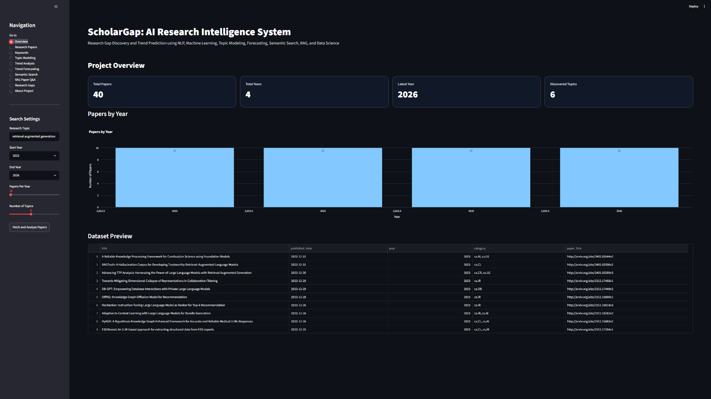
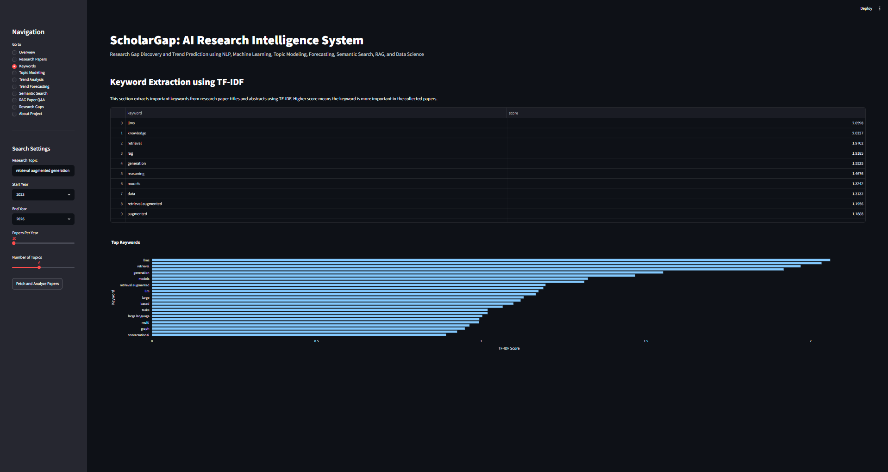
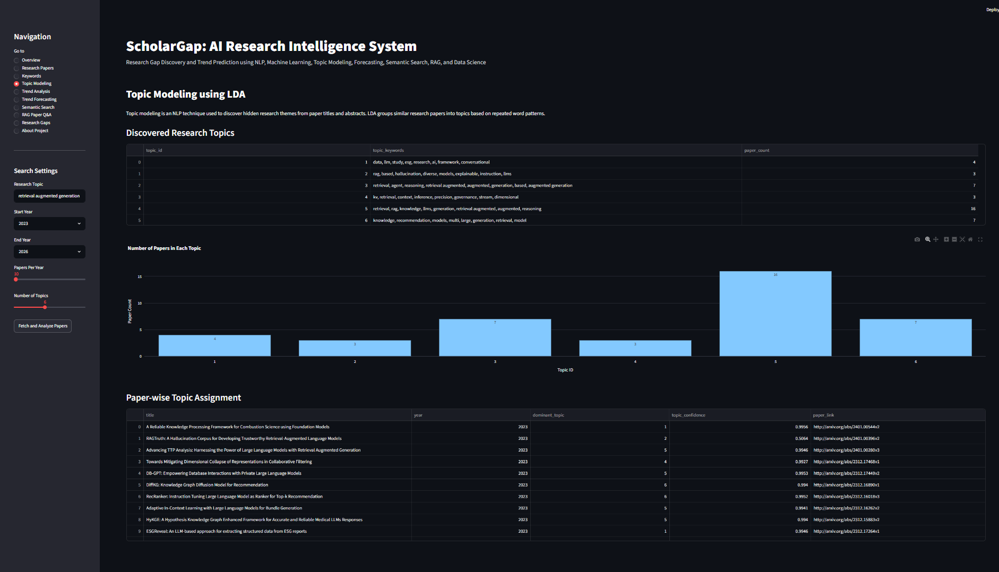
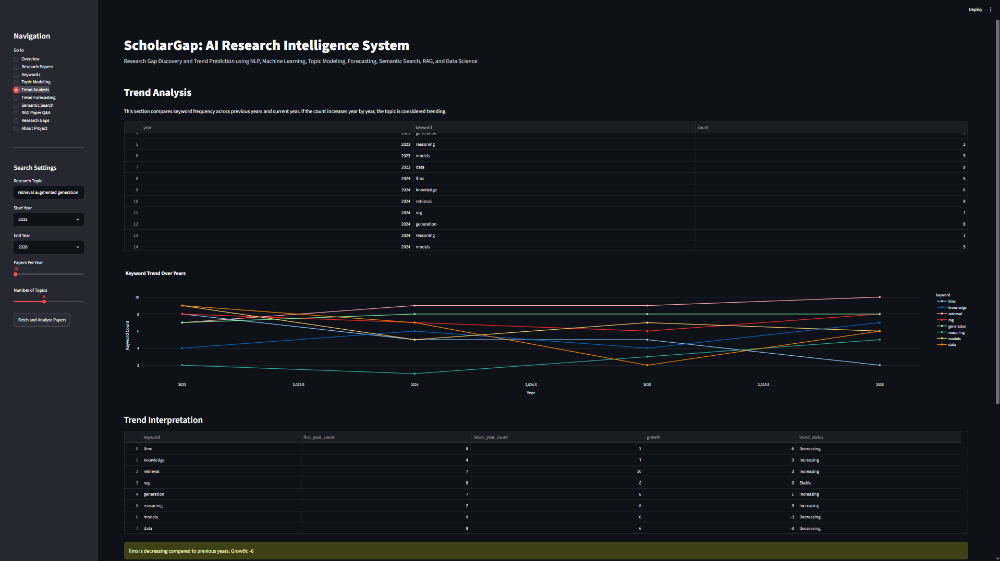
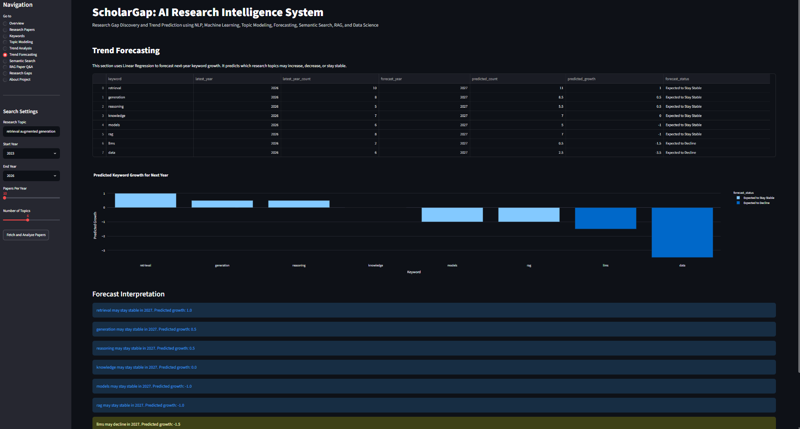
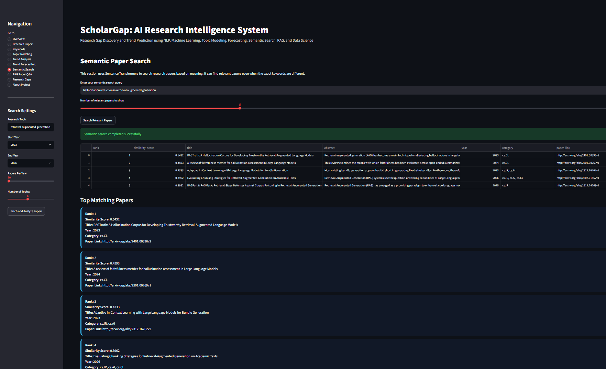
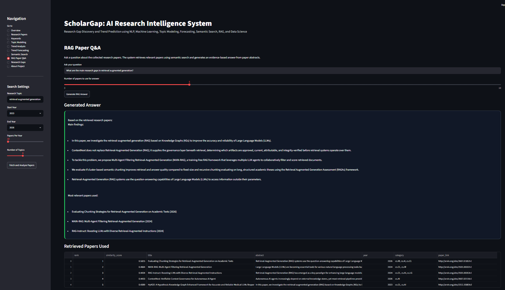
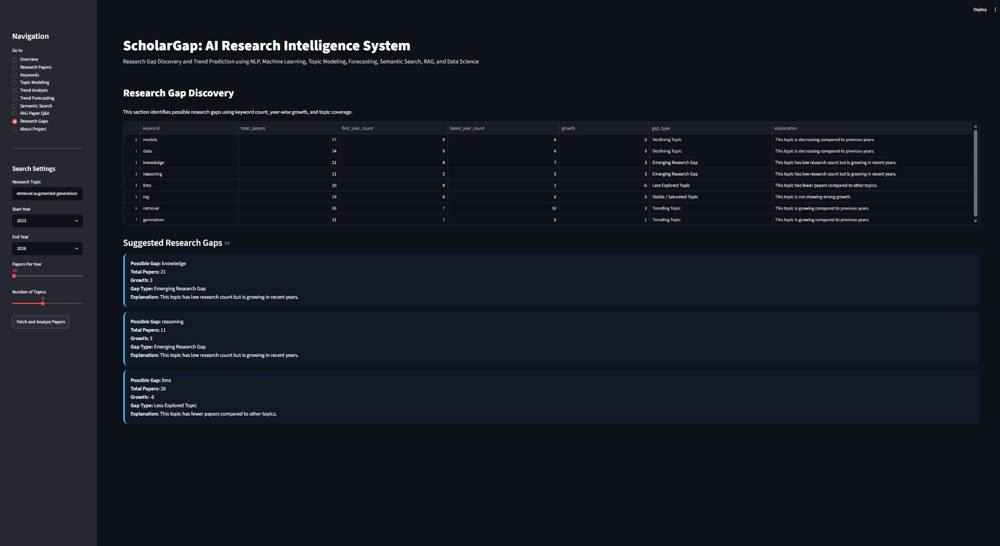

# ScholarGap: AI Research Intelligence System

ScholarGap is a Data Science and NLP project that analyzes research papers from arXiv to identify research trends, topic growth, and possible research gaps.

The project helps students and researchers understand which research areas are trending, declining, saturated, or less explored.

---

## Problem Statement

Students and researchers often struggle to choose good research topics because they may not know:

- Which research topics are currently trending
- Which topics are already saturated
- Which topics are declining
- Which topics are less explored
- Where possible research gaps exist

ScholarGap solves this problem by analyzing research paper titles, abstracts, categories, and publication years using NLP and machine learning techniques.

---

## Key Features

- Fetches research papers from arXiv
- Cleans paper titles and abstracts
- Extracts important keywords using TF-IDF
- Performs topic modeling using LDA
- Analyzes year-wise research trends
- Forecasts future topic growth using Linear Regression
- Performs semantic paper search using Sentence Transformers
- Generates RAG-style answers from paper abstracts
- Detects possible research gaps
- Displays results in an interactive Streamlit dashboard

---

## Tech Stack

- Python
- Streamlit
- Pandas
- NumPy
- Regex
- Scikit-learn
- TF-IDF
- LDA Topic Modeling
- Linear Regression
- Sentence Transformers
- Plotly
- arXiv API

---

## Project Workflow

```text
Research topic input
        ↓
Fetch papers from arXiv
        ↓
Clean titles and abstracts
        ↓
Extract keywords using TF-IDF
        ↓
Discover topics using LDA
        ↓
Analyze year-wise topic trends
        ↓
Forecast future topic growth
        ↓
Perform semantic paper search
        ↓
Generate RAG-style answers
        ↓
Detect possible research gaps
        ↓
Show results in Streamlit dashboard
```

---

## Project Structure

```text
ScholarGap/
│
├── app/
│   └── streamlit_app.py
│
├── assets/
│   ├── overview.png
│   ├── keywords.png
│   ├── topic_modeling.png
│   ├── trend_analysis.png
│   ├── trend_forecasting.png
│   ├── semantic_search.png
│   ├── rag_qa.png
│   └── research_gaps.png
│
├── data/
│   ├── raw/
│   └── processed/
│
├── src/
│   ├── data_collection.py
│   ├── data_cleaning.py
│   ├── data_loading.py
│   ├── keyword_extraction.py
│   ├── topic_modeling.py
│   ├── trend_analysis.py
│   ├── forecasting.py
│   ├── semantic_search.py
│   ├── rag_qa.py
│   ├── gap_detection.py
│   └── visualization.py
│
├── requirements.txt
├── README.md
└── .gitignore
```

---

## Dashboard Pages

The Streamlit dashboard contains the following pages:

### 1. Overview

Shows total papers, total years, latest year, and discovered topics.

### 2. Research Papers

Displays collected research papers with title, abstract, authors, category, year, and paper link.

### 3. Keywords

Shows important keywords extracted using TF-IDF.

### 4. Topic Modeling

Uses LDA to discover hidden research themes from paper titles and abstracts.

### 5. Trend Analysis

Compares keyword frequency across years.

### 6. Trend Forecasting

Uses Linear Regression to predict next-year topic growth.

### 7. Semantic Search

Uses Sentence Transformers to find papers based on meaning, not only exact keywords.

### 8. RAG Paper Q&A

Retrieves relevant papers and generates evidence-based answers from paper abstracts.

### 9. Research Gaps

Suggests possible research gaps based on topic coverage and year-wise growth.

### 10. About Project

Explains the project, features, technologies, and purpose.

---

## Dashboard Screenshots

### Overview



### Keyword Extraction



### Topic Modeling



### Trend Analysis



### Trend Forecasting



### Semantic Search



### RAG Paper Q&A



### Research Gap Discovery



---

## How to Run the Project

### 1. Clone the repository

```bash
git clone <your-github-repository-link>
cd ScholarGap
```

### 2. Install dependencies

```bash
pip install -r requirements.txt
```

### 3. Run the Streamlit app

```bash
python -m streamlit run app/streamlit_app.py
```

---

## What I Learned

While building ScholarGap, I learned how to:

- Work with the arXiv API
- Clean real-world research text data
- Extract keywords using TF-IDF
- Apply LDA topic modeling
- Analyze research trends over time
- Use Linear Regression for forecasting
- Build semantic search using Sentence Transformers
- Create a RAG-style Q&A system
- Detect possible research gaps
- Build an interactive Streamlit dashboard

---

## Future Improvements

- Add PDF full-text paper analysis
- Add citation network analysis
- Add BERTopic for advanced topic modeling
- Add vector database support using FAISS or ChromaDB
- Add LLM-based research gap explanations
- Add exportable PDF research reports
- Deploy the project on Streamlit Cloud

---

## Author

Built by **Sujitha** as a Data Science, NLP, and AI/ML portfolio project.